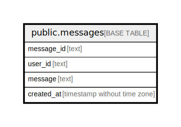

# public.messages

## Description

## Columns

| Name | Type | Default | Nullable | Children | Parents | Comment |
| ---- | ---- | ------- | -------- | -------- | ------- | ------- |
| message_id | text |  | false |  |  |  |
| school | integer |  | false |  |  |  |
| x | integer |  | false |  |  |  |
| y | integer |  | false |  |  |  |
| message | text |  | false |  |  |  |
| created_at | timestamp without time zone |  | false |  |  |  |
| float_time | real |  | false |  |  |  |
| likes | integer | 0 | false |  |  |  |

## Constraints

| Name | Type | Definition |
| ---- | ---- | ---------- |
| messages_pkey | PRIMARY KEY | PRIMARY KEY (message_id) |

## Indexes

| Name | Definition |
| ---- | ---------- |
| messages_pkey | CREATE UNIQUE INDEX messages_pkey ON public.messages USING btree (message_id) |

## Relations

---

> Generated by [tbls](https://github.com/k1LoW/tbls)
