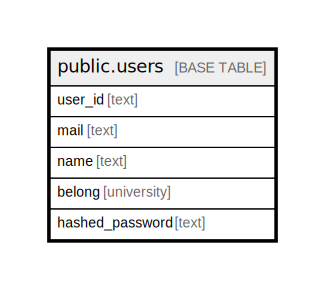

# public.users

## Description

## Columns

| Name | Type | Default | Nullable | Children | Parents | Comment |
| ---- | ---- | ------- | -------- | -------- | ------- | ------- |
| user_id | text |  | false |  |  |  |
| mail | text |  | false |  |  |  |
| name | text |  | false |  |  |  |
| belong | university |  | false |  |  |  |
| hashed_password | text |  | false |  |  |  |

## Constraints

| Name | Type | Definition |
| ---- | ---- | ---------- |
| users_pkey | PRIMARY KEY | PRIMARY KEY (user_id) |
| users_mail_key | UNIQUE | UNIQUE (mail) |

## Indexes

| Name | Definition |
| ---- | ---------- |
| users_pkey | CREATE UNIQUE INDEX users_pkey ON public.users USING btree (user_id) |
| users_mail_key | CREATE UNIQUE INDEX users_mail_key ON public.users USING btree (mail) |

## Relations

---

> Generated by [tbls](https://github.com/k1LoW/tbls)
